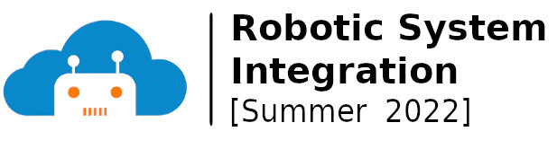

## Robotic System Integration | Summer Course 2022
_Designed and delivered by Eyad Shakab, Arjun Sharma, and Dr. Majid Khonji_ 
[July 13 - July 22]

This high-level course teaches the basics of system integration using Linux OS and Robot Operating System (ROS). The objective is to build technical maturity and problem-solving skills to deal with diverse software efficiently and in a timely manner to get the task done. The course targets audiences from computer science (CS) backgrounds as well as those from other engineering disciplines as long as they are curious to learn beyond the instructions provided. For CS majors, the course will be more like a revision of basics but at the same time integrates different approaches that the student might not have been exposed to together.
## Day 1-2: Linux Basics
_By Eyad Shaklab_

Tasks:

* **Pre1**:[Follow the interactive course by The Construct](https://www.theconstructsim.com/robotigniteacademy_learnros/ros-courses-library/linux-for-robotics/) 
* **Pre2** (Optional): [Python 3 for Robotics](https://www.theconstructsim.com/robotigniteacademy_learnros/ros-courses-library/python-robotics/)

## Day 3: Cloud Computing Basics
_Designed by Majid Khonji, Supervised By Eyad Shaklab_

**Pre-requisites:**

* [Basics of Linux OS](https://www.hostinger.com/tutorials/linux-commands)
* [Fundamentals of computer networks](https://www.ibm.com/cloud/learn/networking-a-complete-guide)

**Parts:**

- **Sys1**: [What is Amazon Web Server (AWS)](sys/sys1.md)
- **Sys2**: [Setup a clould server using AWS](sys/sys2.md)
- **Sys3**: [Back-end and front-end development crash course](sys/sys3.md)

## Day 4-7: Robot Operating System
_By Arjun Sharma_

- **ROS1**:Day 4 slides: [part 1](ros/slides/Lecture_1_Background.pdf) \|  [part 2](ros/slides/Lecture_2_Introduction.pdf) \| [part 3](ros/slides/Lecture_3_Installation_Setup.pdf)
- **ROS2**:Day 5 slides: [part 1](ros/slides/Lecture_4_Run_You_First_ROS_Program.pdf) \| [part 2](ros/slides/Lecture_5_Communicate_with_ROS_Topics.pdf)
- **ROS3**:Day 6 - 7 (morning) slides: [download](ros/slides/Day3-4.pdf)

## Day 7-8: Cloud Robotics
_Designed by Majid Khonji, Supervised by Arjun Sharma_

The objective here is to learn how to integrate one or more robots with a custom cloud server so that you can achieve some collaborative functionalities. We will try to perform those tasks using standard Linux tools avoiding fancy custom-made software as much as possible. The goal is to build a level of technical maturity at a system level that is generic enough to be applicable across domains. The knowledge you gain in this section will be highly transferrable to other domains outside robotics. **It is important to highlight that the tutorial given here is by no mean the most efficient way to develop a production-ready REST API**.

#### Day 7 (21/7/2022):

**Pre-requisites:**

* Basics of networking (ports and ips). If you are not familiar about the topic,  [watch this 10 min video](https://www.youtube.com/watch?v=AXrFCbD4-fU)  before you proceed
* Understanding of [HTTP protocol](https://en.wikipedia.org/wiki/Hypertext_Transfer_Protocol) (a simple text based application protocol, running on top of TCP). [Here is an 8 min video tutorial](https://www.youtube.com/watch?v=eesqK59rhGA)
* Domain Name System (DNS), an application layer protocol. [Here is short video tutorial](https://www.youtube.com/watch?v=mpQZVYPuDGU)
* A working installation of Apache web server on your AWS instance from Day 3
  

**Parts: Understanding Web API**

* **Sys4**: [Fundamentals of Web API: REST](sys/sys4.md)
* **Sys5**: [Building your first API using Common gateway Interface (CGI) on Apache 2](sys/sys5.md)
* **Sys6**: [Debugging REST API on basic level](sys/sys6.md)

## Day 8: Mini-project (22/7/2022)

**Pre-requisites**: 

- Ability to access to a cloud server (AWS, Google, or your [Linux box at home with dynamic dns address + port forwarding (80 and 22)](https://help.dyn.com/remote-access/getting-started-with-remote-access/))
- [Fundamentals of REST](/tutorials/s4)

**Parts:**

* **Sys7**: [More on RESTful Communication](sys/sys7.md)
* Start your mini-project

 

---

 

**Project: RESTful Robot - A Remote Tracking System**

 Deadline: 29/7/2022 

The objective of this exercise is to build a small system that tracks your robots in the cloud. Due to limited time, we will build a simplified system using Turtlebot simulation, but the concept can scale and be applied to any robotic platform. Remember, a robot is simply a computer with sensors and actuators, so you might have a microcontroller (Arduino) connected to a temperature sensor, servo motor, and connected to a PC via a serial connection, USB. That is a legit robot. Increase the number of motors to four, connect a LiDAR and a webcam to the PC, and you get a car capable of autonomous driving. 
In this project, we have two parts:

- Cloud server: which collects telemetry information from one or more robots
- Robot(s): which runs on your laptop. You will write a ROS node that sends POST requests to the server every second to update its location. In this project, you will run a simulated robot, but in principle, the same exact code would run on real robots.

<u>More precisely, you should perform the following tasks:</u>

- Run a Turtlesim simulation. Execute turtlesim_node and  turtle_teleop_key (but you may try more sophisticated simulations as well).
- Remote server connection: Write a ROS node that reads the x and y coordinates of the robot and sends HTTP POST requests to your cloud. Please use three variables in your code to allow easy configuration, `robot_name`, `server_address`, and `api_delay`  where `api_delay` decides how much delay between subsequent API calls; set it to 1 sec.
- RESTful  API: your cloud server should follow the structure below
    -  POST: accept a request following  `<server_address>/robot_name/x/y`, where `<robot_name>` is the name that you chose in the ROS node, and x and y are Turtle coordinates. You may implement a python code (or bash script or any language you like) that receives the query from CGI module and append the received coordinates to a file named `<robot_name>_loc.csv`. You can choose any format for the file, but I suggest something like `yyyy-mm-dd hh:mm:ss, x, x` for each line.
    -  GET: `<server_address>/<robot_name>` returns a simple HTML that shows a PNG plot for robot location. You may implement it in python and use (https://matplotlib.org/) to output a PNG plot. You may need [`plt.plot`](https://matplotlib.org/stable/api/_as_gen/matplotlib.pyplot.plot.html) and `plt.savefig(<robot_name>.png)`
- Test your code with 2-3 of your colleagues and check if your RESTful API is functional
- Optional: 
    - Create an additional API that shows all robot locations: a GET API `<server_address>/All`.
    - Try to show a [live plot using Javascript library](https://canvasjs.com/html5-javascript-dynamic-chart/). 

**Submission Instruction**:

- Send an Email to `eyad.shaklab at ku.ac.ae` and `arjun.sharma at ku.ac.ae`, and CC `majid.khonji at ku.ac.ae`,  titled:
    - `[AV-lab mini-project]: <first_name>_<last_name>`
- In the email, provide the following:
    - Your `<server_address>`. Make sure the server will be running for at least 1 week after your submission, if your server is free. if not, then please  indicate in the email that the server is off.  Our engineer will contact you to switch on the server.
    - Implemented APIs: indicate which APIs are implemented 
    - Attach your ROS node, named `<first_name>_<last_name>.py` (if implemented in python)
        - For computer science folks, you may send your git repo address. For those who are not familiar with `git`, you may [watch this tutorial](https://www.youtube.com/watch?v=8JJ101D3knE) and decide by yourself.

---

**Practical Tips:**

1. **Running Linux Inside Windows**: 
   - **Problem**: Slow performance in a virtual machine or the inconvenience of dual-boot systems.
   - **Solution**: Use Windows Subsystem for Linux (WSL). It allows you to run Linux commands within Windows OS, offering better performance than a virtual machine. [Beginner's Guide to WSL](https://docs.microsoft.com/en-us/windows/wsl/about).

2. **Text Editor Choices**:
   - **Basic**: Use 'gedit' for a user-friendly graphical interface, ideal for local editing.
   - **Advanced**: For power users, 'vim' is a highly efficient text editor. It requires a learning curve but significantly enhances productivity. [Vim Tutorial for Beginners](https://www.youtube.com/watch?v=ggSyF1SVFr4).

3. **Terminal Multiplexer**:
   - **Issue**: Losing SSH connection can terminate all running processes.
   - **Solution**: Use a terminal multiplexer like 'tmux'. It keeps commands running in the background even after disconnection, allowing you to reattach later. It also enables splitting your terminal into multiple areas. [Getting Started with tmux](https://linuxize.com/post/getting-started-with-tmux). See also: [Video Tutorial](https://www.youtube.com/watch?v=Yl7NFenTgIo). Install with: `sudo apt install tmux`.

4. **Tiling Window Manager for Linux**:
   - **Overview**: Linux's flexible architecture allows extensive customization, including the window manager, which organizes window placements.
   - **Recommendation**: Try a tiling window manager like 'i3', which automatically arranges windows into tiles, reducing the need for manual adjustment and enhancing productivity. [Getting Started with i3](https://i3wm.org/). Watch: [Video Tutorial](https://www.youtube.com/watch?v=j1I63wGcvU4).

5. **User-Friendly Shell Alternative**:
   - **Default**: Ubuntu's standard shell is Bash.
   - **Alternative**: Consider 'fish' (friendly interactive shell), known for its excellent auto-complete feature and useful shortcuts. Note: Not all standard bash commands work out-of-the-box. To load bash configuration files in 'fish', use the 'bass' plugin. [Fish Shell Tutorial](https://www.youtube.com/watch?v=C2a7jJTh3kU). More info: [Bass Plugin on GitHub](https://github.com/edc/bass).
